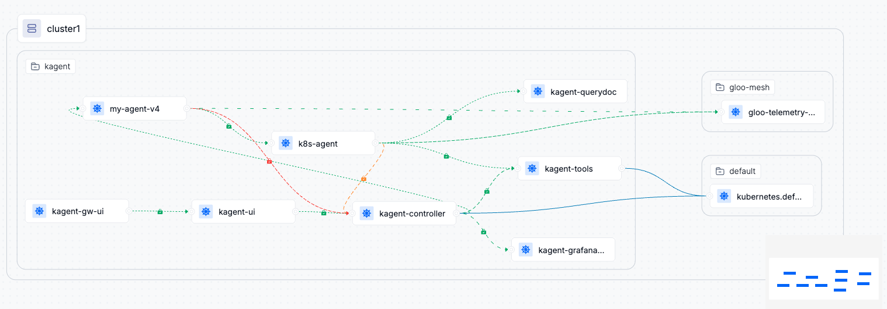

# KAgent Crawl Walk Fly

This demo shows the evolution of agents from simple to more complex ones.

## Prerequisites

- Installed kagent (see [kagent-installation](../../kagent-installation.md))
- Installed Kgateway (see [kgateway-agentgateway](../../kgateway-installation.md))
- (Optional) Installed Gloo Mesh for communication encryption and observability (see [gloo-mesh-installation](../../gloo-mesh-installation.md))

## Run the demo

Let's make istio apply encryption to all the communications in the kagent namespace. Now all the services in the kagent namespace will be able to communicate securely (mtls) and observable.

```bash
# Only if you have installed Istio with Ambient mode
kubectl label namespace kagent istio.io/dataplane-mode=ambient
```

Deploy a gateway to access the kagent UI:

```bash
kubectl apply -f gateway.yaml
```

Get the gateway IP and register a domain:

```bash
export GW_IP=$(kubectl get gtw -n kagent kagent-gw-ui -ojsonpath='{.status.addresses[0].value}')
../../register-domain.sh my-kagent.example ${GW_IP}
```

Access the UI at http://my-kagent.example:8080


## Stage 1: Crawl

Using AI to ask for help. This is a simple agent that uses OpenAI to get help with tasks.

```bash
kubectl apply -f my-agent-v1.yaml
```

Access the UI at http://my-kagent.example:8080 and and ask to the agent:

```text
Create a deployment named 'nginx-deployment' using the nginx image in the existing 'kagent' namespace with 1 replica
```

```text
What is the capital of France?
```


But you don't want that your agent does everything. You want to give it some boundaries, guardrails. You can do that with system prompts:

```no-copy
    systemMessage: |-
      You are an expert Kubernetes assistant designed to help users manage, troubleshoot, and automate Kubernetes environments. Always provide clear, concise, and actionable guidance. When using tools, explain your reasoning and the steps you take. Proactively suggest best practices, security improvements, and optimizations. If a user request is unclear, ask clarifying questions before proceeding. Remain friendly, professional, and focused on helping users achieve their goals efficiently and safely.
      Do not answer anything different than Kubernetes related topics.
```

```bash
kubectl apply -f my-agent-v2.yaml
```

Access the UI and ask the same questions again. The agent will refuse to answer non-kubernetes related questions.

```text
What is the capital of France?
```

## Stage 2: Walk

The agent helps, but you want that you agent is able to run a task by its own. To do so, you need to give it access to `tools` (also called functions).

These actions can be anything, from calling an API, to running a script, to querying a database.

In this case, you want to connect to the kubernetes cluster and run kubectl commands. Kagent comes with an MCP Server with those tools:

```bash
kubectl get remotemcpserver kagent-tool-server -n kagent -oyaml
```

Let's use it with our agent:

```bash
kubectl apply -f my-agent-v3.yaml
```

Access the UI and ask the same questions again. The agent will be able to create the deployment in kubernetes.

```text
Create a deployment named 'nginx-deployment' using the nginx image in the existing 'kagent' namespace with 1 replica
```

## Stage 3: Fly

Now you want your agent to connect to other agents. This is useful for enterprise where different teams have different agents with different permissions.

Check the existing k8s-agent:

```bash
kubectl get agent k8s-agent -n kagent -oyaml
```

Deploy your own agent `my-agent-v4`:

```bash
kubectl apply -f my-agent-v4.yaml
```

Access the UI and try to perform a taks thorug the exisiting k8s-agent. You have entered the multi-agent world!

```text
Create a deployment named 'nginx-deployment2' using the nginx image in the existing 'kagent' namespace with 1 replica
```

> **Note:** If you try to delete, the k8s-agent will refuse because of the system prompt expects that the user confirms destructive actions. However, the default k8s-agent is not well configured, so it will fail. This is an example of the importance of fine-tuning the system prompt to your needs.


### 360 Observability with Ambient Mesh (Optional)

But this is useless if we cannot see anything. How can you ensure that the communication between agents is secure or even hapenning?

Service Mesh already gave us security by defaul. Now let's test observability.

Let's access the Gloo Mesh dashboard (in the mgmt cluster):

```bash
kubectl port-forward --context $MGMT_CONTEXT -n gloo-mesh svc/gloo-mesh-ui 8090
```

Go to the Graph tab and see the communication between agents similar to this:
