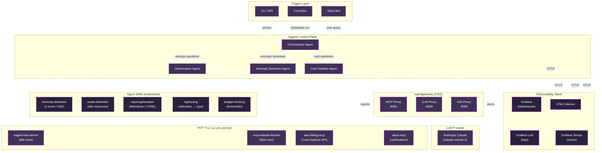

# FinOps Kagent Architecture

```mermaid
graph TB
    subgraph TRIGGERS["Trigger Layer"]
        SLACK["Slack Bot"]
        CRON["CronJobs"]
        CLI["CLI / API"]
    end

    subgraph KAGENT["kagent Control Plane"]
        ORCH["Orchestrator Agent"]
        COST["Cost Visibility Agent"]
        ANOMALY["Anomaly Detection Agent"]
        OPTIM["Optimization Agent"]
    end

    subgraph MCP_SERVERS["MCP Tool Servers (kmcp)"]
        K8S_MCP["kagent-tool-server\n(k8s tools)"]
        FETCH_MCP["mcp-website-fetcher\n(fetch tool)"]
        BILLING_MCP["aws-billing-mcp\n(Cost Explorer API)"]
        SLACK_MCP["slack-mcp\n(notifications)"]
    end

    subgraph SKILLS["Agent Skills (embedded)"]
        S_ANOMALY["anomaly-detection\n(z-score / IQR)"]
        S_WASTE["waste-detection\n(idle resources)"]
        S_REPORT["report-generation\n(Markdown / HTML)"]
        S_RIGHTSIZE["rightsizing\n(utilization → type)"]
        S_BUDGET["budget-tracking\n(thresholds)"]
    end

    subgraph AGENTGW["agentgateway (OSS)"]
        AGW_MCP["MCP Proxy\n:8081"]
        AGW_LLM["LLM Proxy\n:8080"]
        AGW_A2A["A2A Proxy\n:8082"]
    end

    subgraph OBSERVABILITY["Observability Stack"]
        OTEL["OTel Collector"]
        LOKI["Grafana Loki\n(logs)"]
        TEMPO["Grafana Tempo\n(traces)"]
        GRAFANA["Grafana\n(dashboards)"]
    end

    subgraph LLM["LLM Provider"]
        CLAUDE["Anthropic Claude\n(claude-sonnet-4)"]
    end

    %% Trigger → Orchestrator
    SLACK -->|user query| ORCH
    CRON -->|scheduled run| ORCH
    CLI -->|ad-hoc| ORCH

    %% Orchestrator → Domain Agents
    ORCH -->|cost questions| COST
    ORCH -->|anomaly questions| ANOMALY
    ORCH -->|savings questions| OPTIM

    %% Agents → MCP Servers
    COST --> K8S_MCP
    COST --> FETCH_MCP
    COST --> BILLING_MCP
    ANOMALY --> K8S_MCP
    ANOMALY --> BILLING_MCP
    OPTIM --> K8S_MCP
    OPTIM --> FETCH_MCP

    %% Agents → Skills
    ANOMALY -.- S_ANOMALY
    ANOMALY -.- S_BUDGET
    OPTIM -.- S_WASTE
    OPTIM -.- S_RIGHTSIZE
    COST -.- S_REPORT
    ORCH -.- S_REPORT

    %% Agents → agentgateway → LLM
    COST --> AGW_LLM
    ANOMALY --> AGW_LLM
    OPTIM --> AGW_LLM
    ORCH --> AGW_LLM
    AGW_LLM --> CLAUDE

    %% agentgateway MCP routing
    AGW_MCP --> BILLING_MCP
    AGW_MCP --> SLACK_MCP

    %% Notifications
    ANOMALY -->|alerts| SLACK_MCP
    COST -->|reports| SLACK_MCP

    %% Observability
    COST -.->|OTLP| OTEL
    ANOMALY -.->|OTLP| OTEL
    OPTIM -.->|OTLP| OTEL
    ORCH -.->|OTLP| OTEL
    OTEL --> LOKI
    OTEL --> TEMPO
    GRAFANA --> LOKI
    GRAFANA --> TEMPO

    %% Node styles — palette: bg #1a1a24 | box #3f3057 | border #9c36b5 | text #ffffff
    style SLACK fill:#3f3057,stroke:#9c36b5,color:#ffffff,stroke-width:2px
    style CRON fill:#3f3057,stroke:#9c36b5,color:#ffffff,stroke-width:2px
    style CLI fill:#3f3057,stroke:#9c36b5,color:#ffffff,stroke-width:2px
    style ORCH fill:#3f3057,stroke:#9c36b5,color:#ffffff,stroke-width:2px
    style COST fill:#3f3057,stroke:#9c36b5,color:#ffffff,stroke-width:2px
    style ANOMALY fill:#3f3057,stroke:#9c36b5,color:#ffffff,stroke-width:2px
    style OPTIM fill:#3f3057,stroke:#9c36b5,color:#ffffff,stroke-width:2px
    style K8S_MCP fill:#3f3057,stroke:#9c36b5,color:#ffffff,stroke-width:2px
    style FETCH_MCP fill:#3f3057,stroke:#9c36b5,color:#ffffff,stroke-width:2px
    style BILLING_MCP fill:#3f3057,stroke:#9c36b5,color:#ffffff,stroke-width:2px
    style SLACK_MCP fill:#3f3057,stroke:#9c36b5,color:#ffffff,stroke-width:2px
    style S_ANOMALY fill:#2a1f3d,stroke:#9c36b5,color:#ffffff,stroke-width:1px,stroke-dasharray:5 5
    style S_WASTE fill:#2a1f3d,stroke:#9c36b5,color:#ffffff,stroke-width:1px,stroke-dasharray:5 5
    style S_REPORT fill:#2a1f3d,stroke:#9c36b5,color:#ffffff,stroke-width:1px,stroke-dasharray:5 5
    style S_RIGHTSIZE fill:#2a1f3d,stroke:#9c36b5,color:#ffffff,stroke-width:1px,stroke-dasharray:5 5
    style S_BUDGET fill:#2a1f3d,stroke:#9c36b5,color:#ffffff,stroke-width:1px,stroke-dasharray:5 5
    style AGW_MCP fill:#3f3057,stroke:#9c36b5,color:#ffffff,stroke-width:2px
    style AGW_LLM fill:#3f3057,stroke:#9c36b5,color:#ffffff,stroke-width:2px
    style AGW_A2A fill:#3f3057,stroke:#9c36b5,color:#ffffff,stroke-width:2px
    style OTEL fill:#2a1f3d,stroke:#9c36b5,color:#ffffff,stroke-width:2px
    style LOKI fill:#2a1f3d,stroke:#9c36b5,color:#ffffff,stroke-width:2px
    style TEMPO fill:#2a1f3d,stroke:#9c36b5,color:#ffffff,stroke-width:2px
    style GRAFANA fill:#2a1f3d,stroke:#9c36b5,color:#ffffff,stroke-width:2px
    style CLAUDE fill:#3f3057,stroke:#9c36b5,color:#ffffff,stroke-width:2px

    %% All connectors white
    linkStyle 0,1,2,3,4,5,6,7,8,9,10,11,12,13,14,15,16,17,18,19,20,21,22,23,24,25,26,27,28,29,30,31,32,33,34,35 stroke:#ffffff,stroke-width:2px
```

**Theme:** Dark purple palette from `other.svg` (Excalidraw) — Background `#1a1a24` | Boxes `#3f3057` | Borders `#9c36b5` | Text/Lines `#ffffff`
